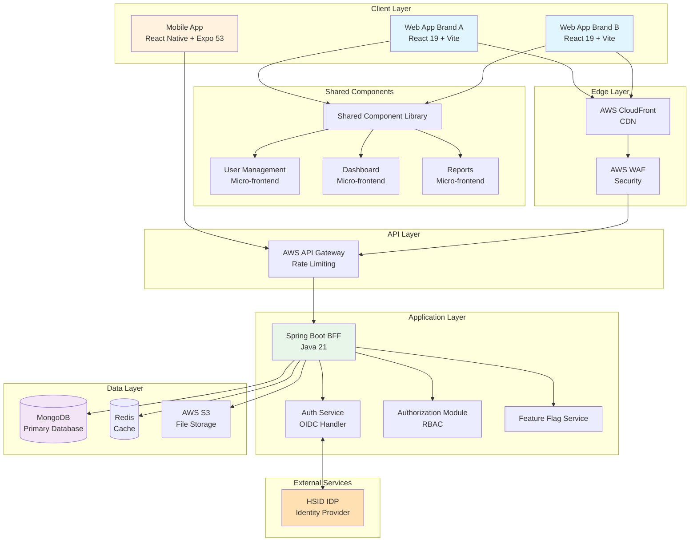
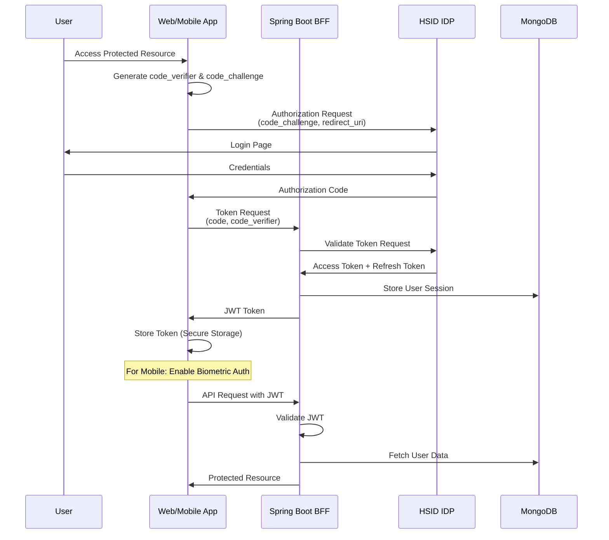
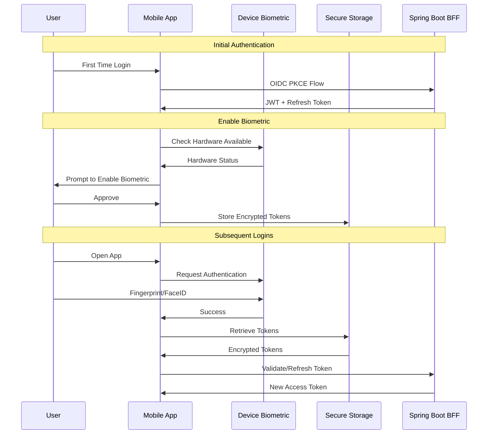
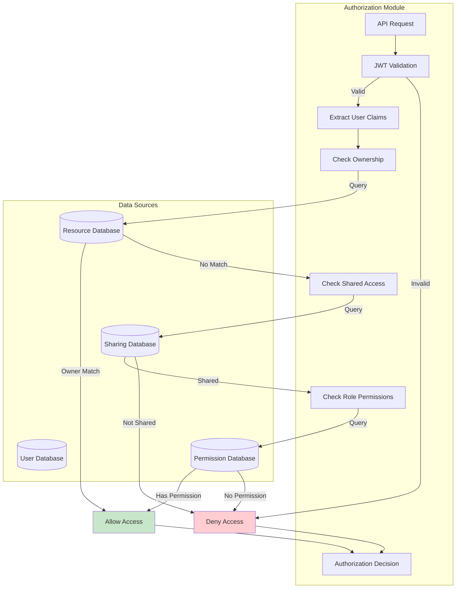
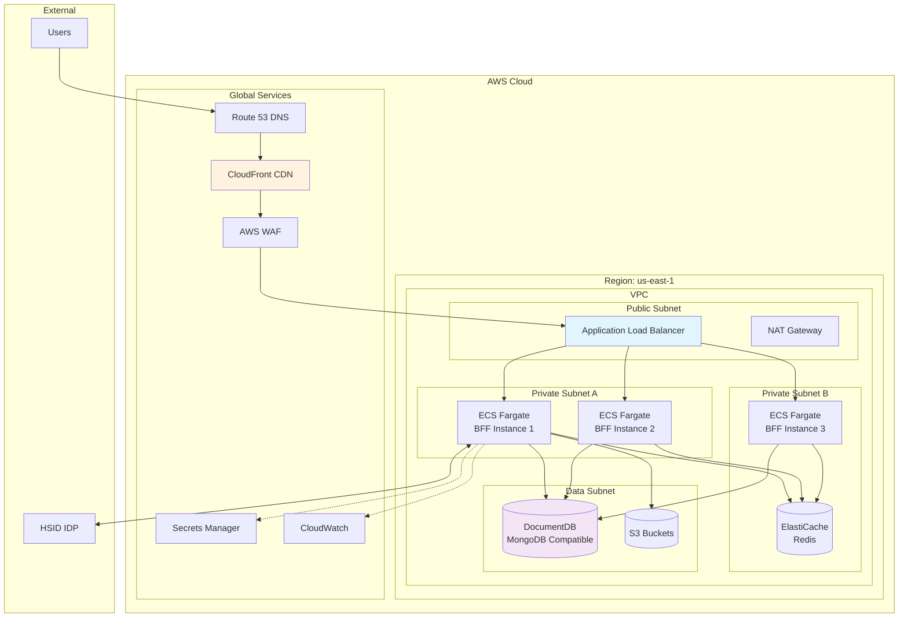
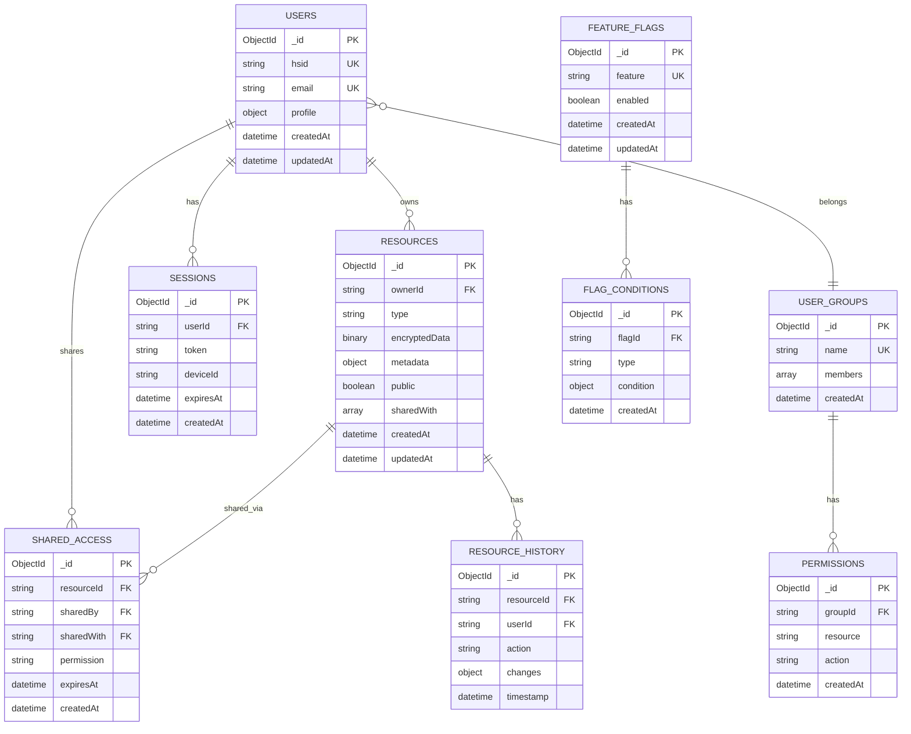
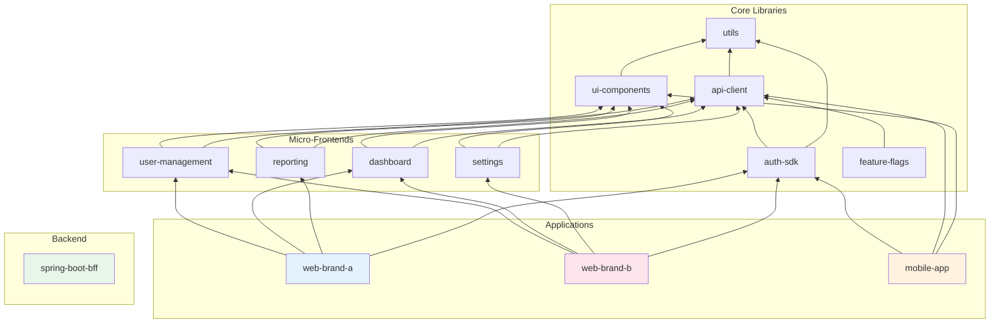

# Architecture Diagrams

## 1. High-Level System Architecture



## 2. Authentication Flow (OIDC PKCE)



## 3. Mobile Biometric Authentication Flow



## 4. Zero Trust Security Architecture

```mermaid
graph TB
    subgraph "Zero Trust Perimeter"
        subgraph "Identity Verification"
            MFA[Multi-Factor Auth]
            OIDC[OIDC Authentication]
            BIO[Biometric Auth]
        end

        subgraph "Device Trust"
            CERT[Certificate Pinning]
            MDM[Device Compliance]
            JAILBREAK[Jailbreak Detection]
        end

        subgraph "Network Security"
            MTLS[Mutual TLS]
            VPN[VPN/Private Network]
            SEGMENT[Micro-segmentation]
        end

        subgraph "Application Security"
            RBAC[Role-Based Access]
            LEAST[Least Privilege]
            JWT[JWT Validation]
        end

        subgraph "Data Security"
            ENCRYPT[Encryption at Rest]
            FIELD[Field-Level Encryption]
            DLP[Data Loss Prevention]
        end

        subgraph "Continuous Verification"
            MONITOR[Real-time Monitoring]
            ANOMALY[Anomaly Detection]
            AUDIT[Audit Logging]
        end
    end

    REQUEST[User Request] --> MFA
    MFA --> OIDC
    OIDC --> BIO
    BIO --> CERT
    CERT --> MDM
    MDM --> JAILBREAK
    JAILBREAK --> MTLS
    MTLS --> VPN
    VPN --> SEGMENT
    SEGMENT --> RBAC
    RBAC --> LEAST
    LEAST --> JWT
    JWT --> ENCRYPT
    ENCRYPT --> FIELD
    FIELD --> DLP
    DLP --> MONITOR
    MONITOR --> ANOMALY
    ANOMALY --> AUDIT
    AUDIT --> RESPONSE[Allowed/Denied]

    style REQUEST fill:#ffcccc
    style RESPONSE fill:#ccffcc
```



## 5. Micro-Frontend Architecture

```mermaid
graph LR
    subgraph "Web Shell A (Brand A)"
        SHELLA[Shell Container]
        ROUTERA[Router]
        THEMEA[Brand A Theme]
    end

    subgraph "Web Shell B (Brand B)"
        SHELLB[Shell Container]
        ROUTERB[Router]
        THEMEB[Brand B Theme]
    end

    subgraph "Shared Micro-Frontends"
        USER[User Management<br/>@company/user-mgmt]
        DASH[Dashboard<br/>@company/dashboard]
        REPORT[Reporting<br/>@company/reports]
        SETTINGS[Settings<br/>@company/settings]
    end

    subgraph "Shared Libraries"
        COMP[UI Components<br/>@company/ui]
        AUTH[Auth SDK<br/>@company/auth]
        API[API Client<br/>@company/api]
        UTILS[Utilities<br/>@company/utils]
    end

    SHELLA --> ROUTERA
    ROUTERA --> USER
    ROUTERA --> DASH
    ROUTERA --> REPORT
    THEMEA --> USER
    
    SHELLB --> ROUTERB
    ROUTERB --> USER
    ROUTERB --> DASH
    ROUTERB --> SETTINGS
    THEMEB --> USER

    USER --> COMP
    USER --> AUTH
    USER --> API
    DASH --> COMP
    DASH --> API
    REPORT --> COMP
    REPORT --> API
    SETTINGS --> COMP
    SETTINGS --> AUTH

    COMP --> UTILS
    AUTH --> UTILS
    API --> UTILS

    style SHELLA fill:#e3f2fd
    style SHELLB fill:#fce4ec
```

## 6. Authorization Data Flow



## 7. Deployment Architecture (AWS)



## 8. CI/CD Pipeline

```mermaid
graph LR
    subgraph "Development"
        DEV[Developer]
        LOCAL[Local Testing]
    end

    subgraph "Version Control"
        GIT[GitHub]
        PR[Pull Request]
        REVIEW[Code Review]
    end

    subgraph "CI Pipeline"
        BUILD[Build<br/>Nx mono repo]
        LINT[Lint<br/>ESLint/Prettier]
        TEST[Test<br/>Jest/Vitest]
        SAST[Security Scan<br/>SonarQube]
        DOCKER[Docker Build]
    end

    subgraph "CD Pipeline"
        STAGING[Deploy to Staging]
        E2E[E2E Tests<br/>Playwright/Detox]
        APPROVAL[Manual Approval]
        PROD[Deploy to Production]
        SMOKE[Smoke Tests]
    end

    subgraph "Monitoring"
        MONITOR[CloudWatch]
        ROLLBACK[Auto Rollback]
    end

    DEV --> LOCAL
    LOCAL --> GIT
    GIT --> PR
    PR --> REVIEW
    REVIEW --> BUILD
    BUILD --> LINT
    LINT --> TEST
    TEST --> SAST
    SAST --> DOCKER
    DOCKER --> STAGING
    STAGING --> E2E
    E2E --> APPROVAL
    APPROVAL --> PROD
    PROD --> SMOKE
    SMOKE --> MONITOR
    MONITOR -.->|On Failure| ROLLBACK

    style DEV fill:#e8f5e9
    style PROD fill:#ffecb3
    style ROLLBACK fill:#ffcdd2
```



## 9. Database Schema Design



## 10. Monorepo Package Dependencies


